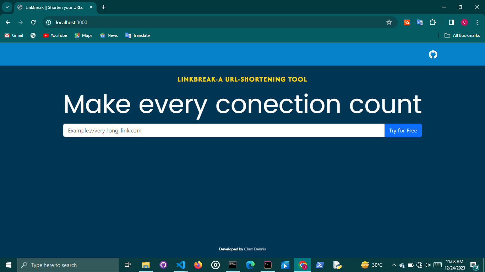

# LinkBreak



**_An [express](https://expressjs.com) app buiit with EJS templating,mongoose(MongoDb) database and [Bootstrap](getbootstrap.com)_** .Use LinkBreak on your local system to shorten URLS of external sites

LinkBreak was a project primarily built to shorten URLs of long sites. It was also built to test my efficinecy on interacting with databases and API routing using [Node.js](nodejs.org).

LinkBreak utilizes [MurmurHash-js](https://github.com/mikolalysenko/murmurhash-js) for **_query encryption and unique identification_** in database management

> _**NOTE:** This project requires MongoDB Driver to be installed on one's local system for its functionality , as it has no external backend connection to any cloud-hosted databse or otherwise._

## Features

1. Simple,Minimal UI Design to enhance user productivity.
2. Fully responsive one-pager site.
3. Built with dark backgrounds with light text to reduce eye strain, especially in low-light environments and potentially extending battery life.
4. Built entirely web-based.

## Built With

1. Express JS - For easier and understable node syntax
2. EJS (Embeded Javascript) - For Page Templaiting
3. Bootstrap - To handle Responsiveness
4. Firebase (deprecated use)

# Getting Started with this project

The following instructions must be followed carefully for the production build and usage of LinkBreak

### Prerequisites

1. MongoDB Driver installed on your local system
2. Git - For cloning this respository :)
3. NPM (Yarn is not advised to be used in this project's production build)

### Installation

1. Clone this repository .

```bash
   cd file/path git clone https://github.com/Chux-Dennis/LinkBreak.git
```

2. Install all dependiencies

```bash
  npm install
```

3. Run on local server

```bash
 node server.js
```

## Deployment

Sadly,this project is not yet live as it was built not primarily for **_pubilc deployment_** yet , however higher versions may include more functionalities which may bring about its deployment.

## Contributions and feedbacks

Contributions are what make the open source community such an amazing place to learn, inspire, and create. Any contributions you make are **greatly appreciated**.Please do well to push feedbacks to me on [Twitter](https://twitter.com/chuxdennis). I am currently open for any collaborations too , feel free to contact me too.

## License

Distributed under the MIT License. See [`LICENSE`](LICENCE) for more information.

## Resources

1. Freepik
2. Remove.bg
3. Github

## Acknowledgement

[Deeshan Sharma](https://github.com/DeeshanSharma/github-jobs) for proper guide on README.md structure and organisation
